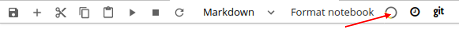
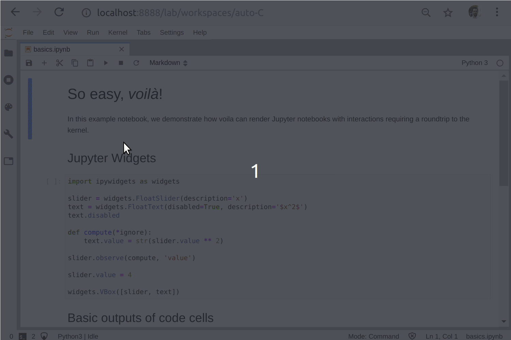
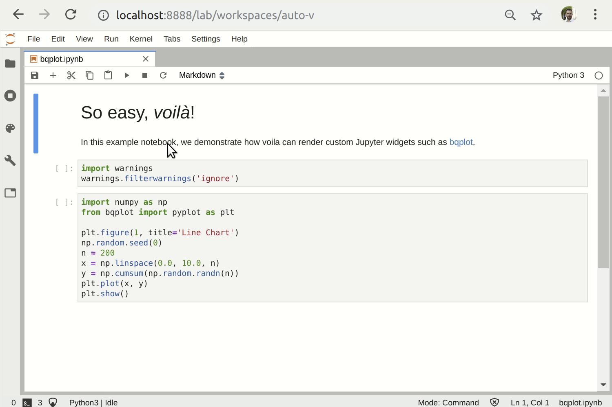
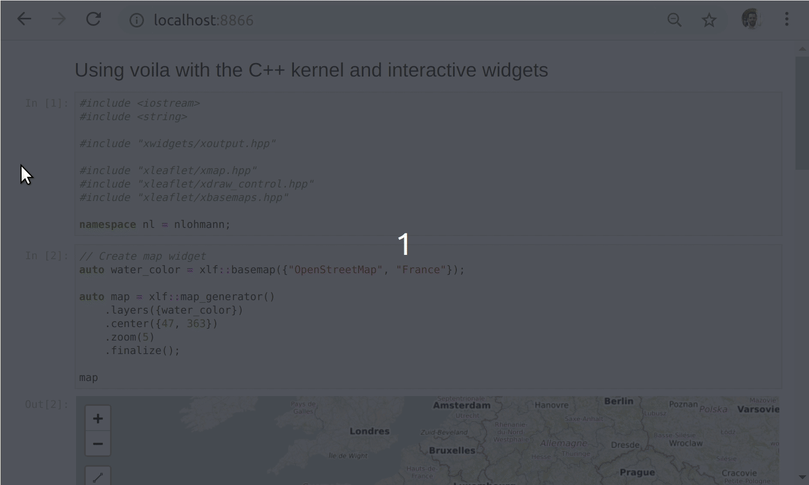
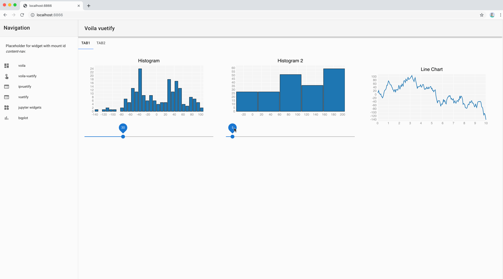

# Jupyter Web Applications

Example web applications using voila and voila-vuetify

## Tutorials

For an in-depth tutorial of `ipywidgets`, please refer to the official [tutorial](https://github.com/jupyter-widgets/tutorial).
A summary can be found under [ipywidgets](./ipywidgets), which contains the bare minimum of information to get you started.

A tutorial for creating your own `ipyvuetify` dashboard can be found [here](./dashboards/vuetify-custom.ipynb).

## Example apps

You can find a collection of example either on the official [voila-gallery website](https://voila-gallery.org/) or in the subdirectory [voila-examples](./voila-examples).  
Unless otherwise specified in the notebooks, you can start voila webapp over the command-line using `voila <your-notebook>`. For possible configuration options, use `voila --help`.
If using JupyterLab with `jupyterlab-preview` installed, you can render a preview of your app with the yellow-grey circle button in the notebook toolbar.

## The different ways to use Voila
The following two examples show how a standalone Jupyter notebook can be turned into a separate app, from the command-line integration.

### Rendering a notebook including interactive widgets and rich mime-type rendering

### Rendering a notebook making use of a custom widget library ([bqplot](https://github.com/bloomberg/bqplot

### Voilà dashboards with other language kernels

Voilà is built upon Jupyter standard formats and protocols, and is agnostic to the programming language of the notebook. In this example, we present an example of a Voilà application powered by the C++ Jupyter kernel [xeus-cling](https://github.com/QuantStack/xeus-cling), and the [xleaflet](https://github.com/QuantStack/xleaflet) project.

### To use the gridstack template, pass option --template=gridstack to the voila command line

### Using the voila-vuetify template with Jupyter widgets based on vuetify UI components which implement Google's Material Design Spec with the Vue.js framework

